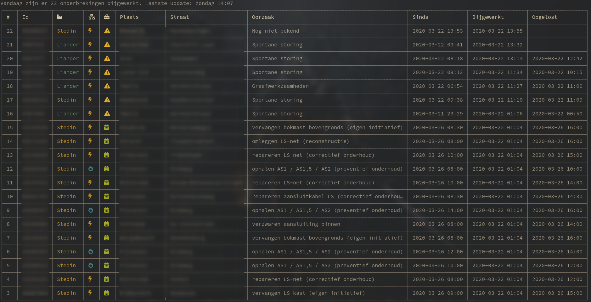

# EnerCli 

Commandline dashboard showing disruptions updated today.  
Data from https://energieonderbrekingen.nl/



Prerequisites:

* client_id and client_secret for the api
* node >= 13
* dark terminal with font awesome installed

## Install

```
git clone https://github.com/akkerman/enercli.git
cd enercli
npm install
node index.mjs
```


## Shortcuts

| key      | function              |
| :--      | :--                   |
| `ctrl+c` | Exit application      |
| `ctrl+l` | Clear screen, refresh |

## Run with docker

```sh
docker build -t enercli https://github.com/akkerman/enercli.git
docker run -it --rm --name enercli -e client_id=<your_client_id> -e client_secret=<your_client_secret> enercli
```

